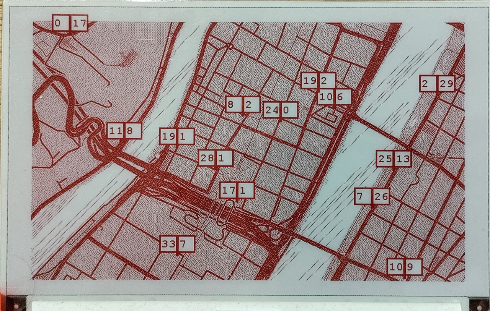

# Projet Vélo'v Tracker ESP32
## Introduction
Le Vélo'v Tracker est un projet qui affiche en temps réel les disponibilités des stations Vélo'v de Lyon sur un écran e-paper connecté à un ESP32.

Le système récupère les données depuis l'API officielle de Vélo'v et les affiche sur une carte de la ville pour les stations choisies. Chaque station est représentée par un rectangle contenant le nombre de vélos et d'emplacements disponibles.



## Installation
### Matériel requis

- ESP32
- Écran e-paper Waveshare (7 in 5b HD)

### Connexions

- BUSY -> GPIO25
- RST -> GPIO26
- DC -> GPIO27
- CS -> GPIO15
- CLK -> GPIO13
- DIN -> GPIO33
- GND -> GND
- 3.3V -> 3.3V

Voir le [fichier](src/screen/config.h) de configuration
### Configuration du code
#### Image de fond

- Récupérez une photo de la zone que vous souhaitez afficher. Exemple : [site de cartes personnalisables](https://snazzymaps.com/style/287755/grayscale-style)

- Convertissez l'image en format [bitmap monochrome](https://javl.github.io/image2cpp/).
- Placez le code généré du bitmap dans le [fichier](src/screen/image.cpp).
- Si nécessaire, ajustez la [lige suivante](src/main.cpp) :

```c
Paint_DrawImage(maps_image, 40, 24, 800, 480);
```
en:
```c
Paint_DrawImage(maps_image, X_debut, Y_debut, X_taille, Y_taille);
```

#### Configuration WiFi
Modifiez les constantes  `ssid` et `password` avec vos informations de connexion WiFi dans le [fichier](src/main.cpp).

#### Ajouter/supprimer des stations

- Dans le vecteur [stationsToMonitor](src/main.cpp), ajoutez ou modifiez les stations que vous souhaitez surveiller. Chaque station est définie par son ID et ses coordonnées X et Y sur l'écran. (Les ID sont affichés sur les bornes et dans l'application)

Exemple :
```c
cppCopystd::vector<Station> stationsToMonitor = {
    //        ID     X    Y
    Station("2003", 430, 200),
    Station("2004", 420, 360),
    // Ajoutez d'autres stations ici
};
```
Pour vous aider à placer les stations, commentez les [lignes suivantes](src/main.cpp):
```c
  setupWiFi();

  stationManager.updateStations();
  stationManager.printAllStations();
```
et décomanter:
```
  // help();
```
Cette fonction help() affichera un quadrillage sur l'écran pour faciliter le positionnement précis des stations.